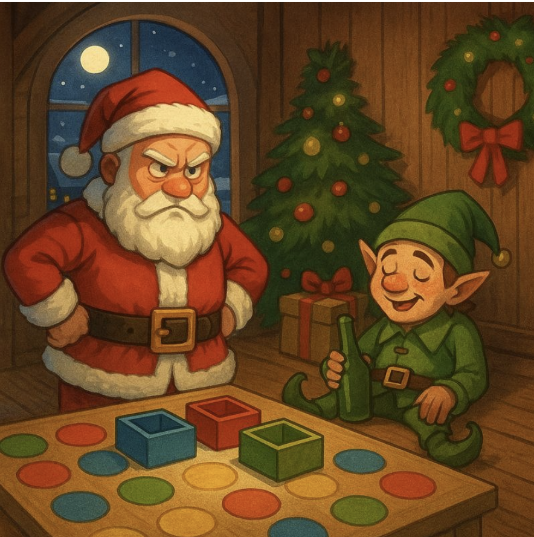
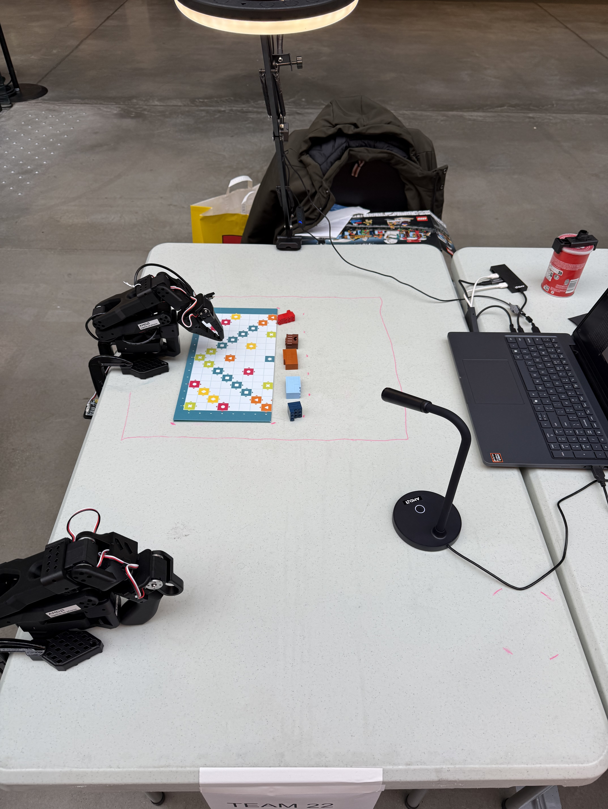
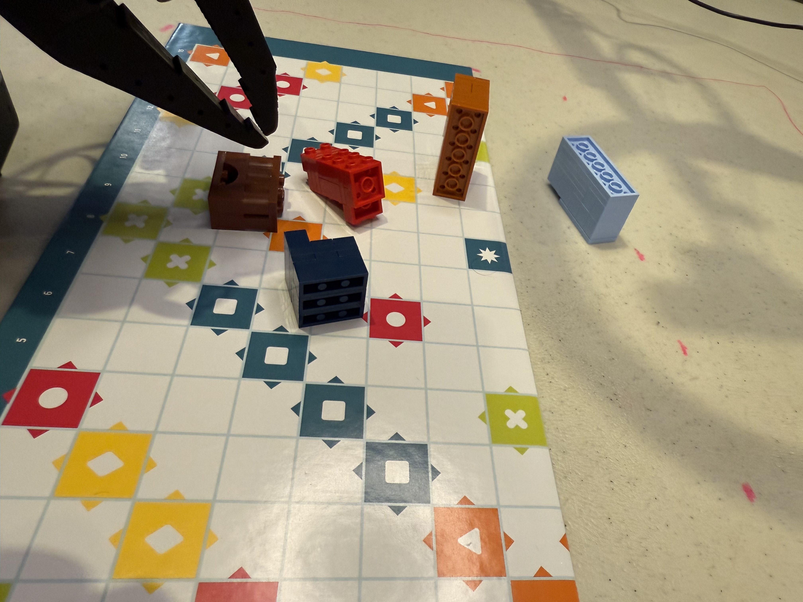

**It's christmas eve tomorrow...**

**Santa needs to deliver gifts...**

**The elves had… uh… a little too much mulled wine.**

# AMD_Robotics_Hackathon_2025_SantaBot_Gift_Dispatcher

## Team Information

**Team:** versag  
**Members:** Sagar Verma  

**Summary**  
SantaBot is a festive, kid-friendly tabletop game where children “command Santa’s robot” to pick a colored gift from a central pile and place it into the correct destination square. Under the hood, I collected an imitation-learning dataset under realistic variability (clutter + day/night + warm/white/blue LED sweeps) and trained **two policies (ACT and smolVLA2)** to study robustness for real-world sorting.

**Project media**

**Robot data collection views (4x3 grid: Front / Side / Top)**

<table>
<tr>
<td><strong>Front View</strong></td>
<td><strong>Front View</strong></td>
<td><strong>Front View</strong></td>
<td><strong>Front View</strong></td>
</tr>
<tr>
<td><video width="200" height="150" controls><source src="assets/clips/front/episode_000.mp4" type="video/mp4"></video></td>
<td><video width="200" height="150" controls><source src="assets/clips/front/episode_001.mp4" type="video/mp4"></video></td>
<td><video width="200" height="150" controls><source src="assets/clips/front/episode_002.mp4" type="video/mp4"></video></td>
<td><video width="200" height="150" controls><source src="assets/clips/front/episode_003.mp4" type="video/mp4"></video></td>
</tr>
<tr>
<td><strong>Side View</strong></td>
<td><strong>Side View</strong></td>
<td><strong>Side View</strong></td>
<td><strong>Side View</strong></td>
</tr>
<tr>
<td><video width="200" height="150" controls><source src="assets/clips/side/episode_000.mp4" type="video/mp4"></video></td>
<td><video width="200" height="150" controls><source src="assets/clips/side/episode_001.mp4" type="video/mp4"></video></td>
<td><video width="200" height="150" controls><source src="assets/clips/side/episode_002.mp4" type="video/mp4"></video></td>
<td><video width="200" height="150" controls><source src="assets/clips/side/episode_003.mp4" type="video/mp4"></video></td>
</tr>
<tr>
<td><strong>Top View</strong></td>
<td><strong>Top View</strong></td>
<td><strong>Top View</strong></td>
<td><strong>Top View</strong></td>
</tr>
<tr>
<td><video width="200" height="150" controls><source src="assets/clips/top/episode_000.mp4" type="video/mp4"></video></td>
<td><video width="200" height="150" controls><source src="assets/clips/top/episode_001.mp4" type="video/mp4"></video></td>
<td><video width="200" height="150" controls><source src="assets/clips/top/episode_002.mp4" type="video/mp4"></video></td>
<td><video width="200" height="150" controls><source src="assets/clips/top/episode_003.mp4" type="video/mp4"></video></td>
</tr>
</table>

  

---

## Submission Details

### 1. Mission Description

**Mission:** *Elf-Rescue Gift Delivery*  

It’s December. Santa needs help delivering gifts, but the elves had too much mulled wine. Kids become dispatchers: they choose which gift color must be delivered next, and SantaBot executes the pick-and-place.

**Real-world application**  
This is a practical abstraction of real pick-and-place logistics: **sorting items into bins/zones based on an instruction**. The “kid game” framing makes it approachable, while the underlying behavior is the same primitive needed for warehouse kitting, tabletop sorting, and bin packing.

**Arena (v1 — what I built and tested)**  
- A static grid board with many white squares and a distributed set of colored destination squares (red, orange, yellow, green, dark-blue).
- A central “gift pile” region where LEGO-like blocks start in random poses and clutter.
- The target is to place each selected block into its corresponding destination square.

**Instruction / prompt mapping used in the dataset**  
(These prompts were included in the dataset and were used for smolVLA2 training.)
- `pick red cube and put in red square`
- `pick orange cube and put in orange square`
- `pick brown cube and put in yellow square`
- `pick light-blue cube and put in green square`
- `pick dark-blue cube and put in dark-blue square`

> Note: A few mappings are intentionally **not identity-by-color** (e.g., brown→yellow, light-blue→green) to test instruction following rather than only color matching.

---

### 2. Creativity

**What is novel or unique in the approach?**  
- A **Christmas-themed “Santa logistics” game** that makes robotics approachable for kids while still being a real manipulation problem.
- A deliberately **hackathon-realistic** setup: clutter, imperfect placements, varied object orientations, and major lighting variation.
- Training and comparing **two imitation learning approaches (ACT vs smolVLA2)** on the same task/dataset family.

**Innovation in design / methodology / application**  
The dataset intentionally includes:
- easy/ideal layouts
- difficult layouts (tight packing, occlusions, long-side-up orientations)
- both night + day domains to reduce illumination bias
- night-time LED color sweeps (warm/white/blue) as collection-level augmentation

---

### 3. Technical implementations

#### Teleoperation / Dataset capture
- **305 episodes**, each **~10–12 seconds**
- **145 night-time** episodes with overhead LED lighting cycled across **warm / white / blue**
- **160 daytime** episodes to reduce day/night bias
- Objects: LEGO-like blocks with varied shapes/orientations (red, orange, brown, light-blue, dark-blue)
- Scenarios include both:
  - “ideal” configurations
  - “hard” configurations (tight clustering, occlusions, long side up)

**Datasets on Hugging Face**
- Daytime dataset: `versag/santabot_gift_packaging_v3` (160 episodes, 32.3k frames)  
  https://huggingface.co/datasets/versag/santabot_gift_packaging_v3
- Nighttime dataset: `versag/santabot_gift_packaging_v2` (145 episodes)  
  https://huggingface.co/datasets/versag/santabot_gift_packaging_v2

**Example configurations**
  
  
  

#### Training
Trained **two policies**:
- **ACT** (behavior cloning baseline)  
  Model: `versag/act_santabot_gift_packaging_v3_10ksteps`  
  https://huggingface.co/versag/act_santabot_gift_packaging_v3_10ksteps
- **smolVLA2** (instruction-conditioned policy using the prompts above)  
  Model: `versag/smolvla_santabot_gift_packaging_v2_10ksteps`  
  https://huggingface.co/versag/smolvla_santabot_gift_packaging_v2_10ksteps

**Day vs Night training**  
- I trained **day-only** and **night-only** variants.
- Next step (planned): train a **combined day+night** model for maximum robustness.

#### Inference
At runtime, the user provides an instruction for the next “gift” to deliver (via deterministic UI like keyboard/buttons — not voice due to hackathon noise). The policy executes:

**approach → grasp → move → place → reset**

**Demo video**
> If GitHub does not render embedded video tags, consider adding a GIF or linking the video file directly.
<video width="640" height="480" controls>
  <source src="assets/IMG_8986.MOV" type="video/quicktime">
  Your browser does not support the video tag.
</video>

---

### 4. Ease of use

**How generalizable is the implementation across tasks or environments?**  
- The command format is minimal and human-friendly:  
  **"pick `<object>` and put in `<target>`"**
- The same pipeline extends to:
  - new object colors/shapes
  - new target zones (bins, squares, “chimneys”)
  - new board layouts (as long as reachable and visible)

**Flexibility and adaptability**  
- Adding new “gift types” is straightforward: collect additional demos for the new instruction and fine-tune.
- The dataset already includes substantial variation (pose, clutter, illumination) to support better real-world robustness.

**Types of commands or interfaces needed**  
- Avoid voice (noisy hackathon). Use:
  - keyboard shortcuts
  - on-screen color buttons
  - optional physical colored buttons (best for public demos)

---

## Results / Observations

### Policy performance (ACT vs smolVLA2)
- **ACT worked well out-of-the-box** for this tabletop pick-and-place setting:
  - reliable pickup
  - generally correct transport toward the intended target region
- **smolVLA2 did not work reliably in the current setup**:
  - it often fails early and is **not able to consistently reach the correct colored block**
  - likely needs additional tuning (prompt formatting, dataset balance, training hyperparameters, or config alignment)

### Current limitation (placement accuracy)
- With **ACT**, the main remaining issue is **final placement precision**:
  - the policy often places the object **near the correct destination square**, but occasionally in a **neighboring square** (~1 cell off)
- Likely next improvements:
  - **more demonstrations** emphasizing the final approach and exact placement
  - **tuning** (action scaling, control smoothing, curriculum focusing on “final centimeters”)

---

## Why this matters (real-world relevance)

Even though the demo is framed as a Christmas/kids game, the underlying task is a realistic version of **sorting and placement under real-world complexity**:
- cluttered scenes (tight packing)
- varied object orientations (long side up)
- strong lighting shifts (day vs night; warm/white/blue LED)
- instruction-conditioned sorting (object-to-target mapping)

This closely relates to:
- warehouse kitting and sorting
- tabletop logistics
- bin packing / routing
- general manipulation primitives that must work outside clean lab conditions

---

## Motivation

My original motivation was to introduce **bin packing and color sorting** as a fun, interactive game for kids using **LeRobot**:
- kids issue simple dispatch commands (which gift to deliver next)
- the robot performs the pick-and-place
- the game naturally teaches sorting + routing (logistics) through play

---

## Scope of this hackathon demo

This submission is intentionally scoped to the **core engineering challenge**:
- dataset capture (teleop episodes under diverse conditions)
- training and comparing policies (ACT vs smolVLA2)
- analyzing failure modes and what it takes to close the gap for a robust public-facing game

In other words: this is a credible step toward a kid-friendly sorting game, and it highlights the practical gap between “works in controlled conditions” and “works reliably in the wild.”

---

## Additional Links

**Models on Hugging Face**
- ACT model: `versag/act_santabot_gift_packaging_v3_10ksteps`  
  https://huggingface.co/versag/act_santabot_gift_packaging_v3_10ksteps
- smolVLA2 model: `versag/smolvla_santabot_gift_packaging_v2_10ksteps`  
  https://huggingface.co/versag/smolvla_santabot_gift_packaging_v2_10ksteps

**Datasets on Hugging Face**
- Daytime dataset: `versag/santabot_gift_packaging_v3`  
  https://huggingface.co/datasets/versag/santabot_gift_packaging_v3
- Nighttime dataset: `versag/santabot_gift_packaging_v2`  
  https://huggingface.co/datasets/versag/santabot_gift_packaging_v2

---
